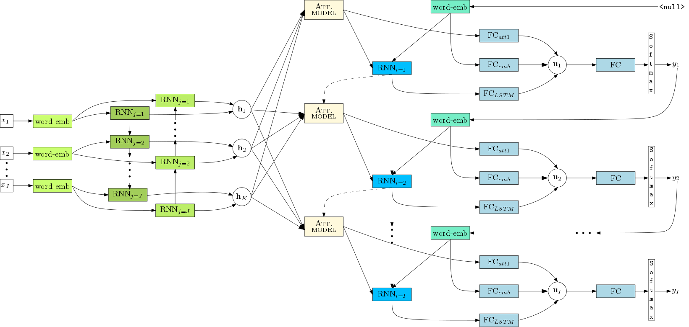
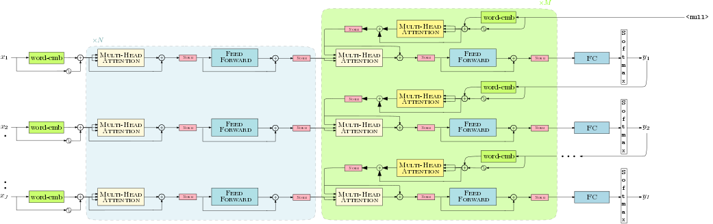

=========
NMT-Keras
=========

Neural Machine Translation with Keras.

********
Features
********
 * Attention RNN and Transformer models.
 * Online learning and Interactive neural machine translation (INMT). See `the interactive NMT branch`_.
 * Tensorboard integration. Training process, models and word embeddings visualization.
 * Attention model over the input sequence of annotations.
   - Supporting Bahdanau (Add) and Luong (Dot) attention mechanisms.
   - Also supports double stochastic attention.
 * Peeked decoder: The previously generated word is an input of the current timestep.
 * Beam search decoding.
   - Featuring length and source coverage normalization.
 * Ensemble decoding.
 * Translation scoring.
 * N-best list generation (as byproduct of the beam search process).
 * Support for GRU/LSTM networks:
   - Regular GRU/LSTM units.
   - Conditional_ GRU/LSTM units in the decoder.
   - Multilayered residual GRU/LSTM networks.
 * Unknown words replacement.
 * Use of pretrained (Glove_ or Word2Vec_) word embedding vectors.
 * MLPs for initializing the RNN hidden and memory state.
 * Spearmint_ wrapper for hyperparameter optimization.
 * Client-server_ architecture for web demos.

.. _Spearmint: https://github.com/HIPS/Spearmint
.. _Glove: http://nlp.stanford.edu/projects/glove/
.. _Conditional: https://arxiv.org/abs/1703.04357
.. _Word2Vec: https://code.google.com/archive/p/word2vec/
.. _the interactive NMT branch: https://github.com/lvapeab/nmt-keras/tree/interactive_NMT
.. _Client-server: https://github.com/lvapeab/nmt-keras/tree/master/demo-web

*****
Guide
*****
.. toctree::
   :maxdepth: 2

   requirements
   usage
   configuration
   resources
   tutorial
   modules
   help

******************
Indices and tables
******************

* :ref:`genindex`
* :ref:`modindex`
* :ref:`search`
