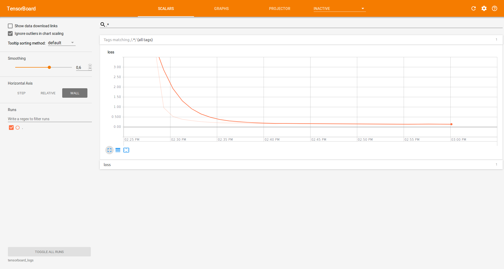
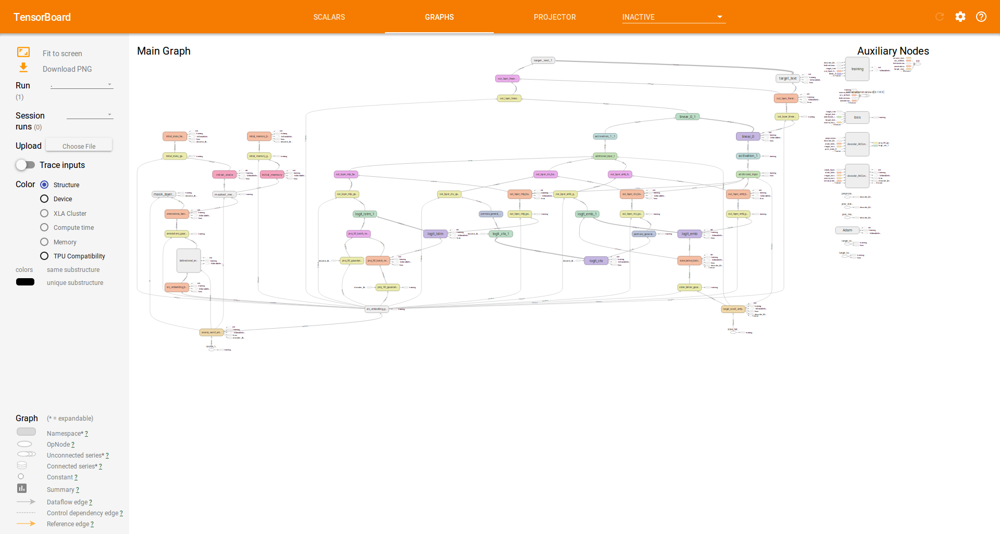
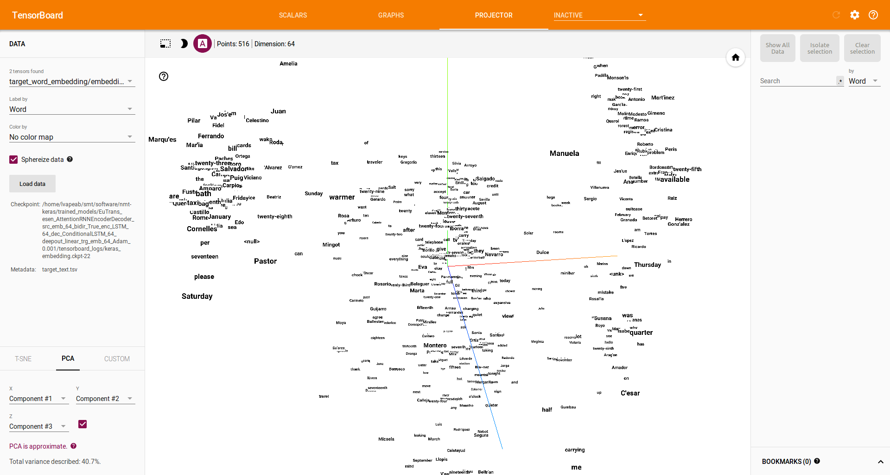

*********
Resources
*********

Theoretical NMT
===============
Before using an NMT, you should read and understand the `theoretical basis`_ of attentional NMT systems.

NMT-Keras Step-by-step
======================
- NMT-Keras step-by-step guide (iPython_ and html_ versions): Tutorials for running this library. They are expected to be followed in order:

    1. `Dataset setup`_: Shows how to invoke and configure a Dataset instance for a translation problem.
    2. `Training tutorial`_: Shows how to call a translation model, link it with the dataset object and build callbacks for monitorizing the training.
    3. `Decoding tutorial`_: Shows how to call a trained translation model and use it to translate new text.
    4. `NMT model tutorial`_: Shows how to build a state-of-the-art NMT model with Keras in few (~50) lines.

NMT-Keras Output
================
This is a brief explanation about the typical output produced by the training pipeline of NMT-Keras.
Assuming that we launched NMT-Keras for the example from tutorials, we'll have the following tree of folders (after 1 epoch)::

   ├── trained_models
   │   ├── EuTrans_GroundHogModel_src_emb_420_bidir_True_enc_600_dec_600_deepout_maxout_trg_emb_420_Adam_0.001
   │   │   ├── config.pkl
   │   │   ├── epoch_1_Model_Wrapper.pkl
   │   │   ├── epoch_1_structure_init.json
   │   │   ├── epoch_1_structure.json
   │   │   ├── epoch_1_structure_next.json
   │   │   ├── epoch_1_weights.h5
   │   │   ├── epoch_1_weights_init.h5
   │   │   ├── epoch_1_weights_next.h5
   │   │   ├── val.coco
   │   │   ├── val_epoch_1.pred

Let's have a look to these files.

    - `config.pkl`: Pickle containing the training parameters.
    - `epoch_1_Model_Wrapper.pkl`: Pickle containing the Model_Wrapper object that we have trained.
    - `epoch_1_structure.json`:  Keras json specifying the layer and connections of the model.
    - `epoch_1_structure_init.json`: Keras json specifying the layer and connections of the model_init (see tutorial 4 for more info about the model).
    - `epoch_1_structure_next.json`: Keras json specifying the layer and connections of the model_next (see tutorial 4 for more info about the model).
    - `epoch_1_weights.h5`: Model parameters (weight matrices).
    - `epoch_1_weights_init.h5`: Model init parameters (weight matrices).
    - `epoch_1_weights_next.h5`: Model next parameters (weight matrices).
    - `val.coco`: Metrics dump. This file is name as [tested_split].[metrics_name]. It contains a header with the metrics name and the value of all evaluations (epoch/updates). For instance::

    epoch,Bleu_1, Bleu_2, Bleu_3, Bleu_4, CIDEr, METEOR, ROUGE_L,
    1,0.906982874122, 0.875873151361, 0.850383597611, 0.824070996966, 8.084477458, 0.550547408997, 0.931523374569,
    2,0.932937494321, 0.90923787501, 0.889965151506, 0.871819102335, 8.53565391657, 0.586377788443, 0.947634196936,
    3,0.965579088172, 0.947927460597, 0.934090548706, 0.920166838768, 9.0864109399, 0.63234570058, 0.971618921459,

* `val_epoch_1.pred`: Raw file with the output of the NMT system at the evaluation performed at the end of epoch 1.

We can modify the save and evaluation frequencies from the `config`_ file.

Tensorboard integration
=======================
`TensorBoard`_ is a visualization tool provided with TensorFlow.

It can be accessed by NMT-Keras and provide visualization of the learning process, dynamic graphs of our training and metrics, as well representation of different layers (such as word embeddings). Of course, this tool is only available with the Tensorflow backend.

In this document, we'll set some parameters and explore some of the options that Tensorboard provides. We'll:
    * Configure Tensorboard and NMT-Keras.
    * Visualize the learning process (loss curves).
    * Visualize the computation graphs built by NMT Keras.
    * Visualize the words embeddings obtained during the training stage.

In the [configuration file] we have available the following tensorboard-related options::

   TENSORBOARD = True                       # Switches On/Off the tensorboard callback
   LOG_DIR = 'tensorboard_logs'             # Directory to store teh model. Will be created inside STORE_PATH
   EMBEDDINGS_FREQ = 1                      # Frequency (in epochs) at which selected embedding layers will be saved.
   EMBEDDINGS_LAYER_NAMES = [               # A list of names of layers to keep eye on. If None or empty list all the embedding layer will be watched.
   'source_word_embedding',
   'target_word_embedding']
   EMBEDDINGS_METADATA = None               # Dictionary which maps layer name to a file name in which metadata for this embedding layer is saved.
   LABEL_WORD_EMBEDDINGS_WITH_VOCAB = True  # Whether to use vocabularies as word embeddings labels (will overwrite EMBEDDINGS_METADATA)
   WORD_EMBEDDINGS_LABELS = [               # Vocabularies for labeling. Must match EMBEDDINGS_LAYER_NAMES
                            'source_text',
                            'target_text']

With these options, we are telling Tensorboard where to store the data we want to visualize: loss curve, computation graph and word embeddings.
Moreover, we are specifying the word embedding layers that we want to visualize. By setting the `WORD_EMBEDDINGS_LABELS` to the corresponding `Dataset` ids,
we can print labels in the word embedding visualization.

Now, we run a regular training: `python main.py`. If we `cd` to the model directory, we'll see a directiory named `tensorboard_logs`. Now, we launch Tensorboard on this directory::

   $ tensorboard --logdir=tensorboard_logs
   TensorBoard 0.1.5 at http://localhost:6006 (Press CTRL+C to quit)

We can open Tensorboard in our browser (http://localhost:6006) with the NMT-Keras information:

Loss curve
----------

Model graphs
------------

Embedding visualization
-----------------------

.. _theoretical basis: https://github.com/lvapeab/nmt-keras/blob/master/examples/documentation/neural_machine_translation.pdf
.. _iPython:  https://github.com/lvapeab/nmt-keras/blob/master/examples
.. _html: ./tutorial.html
.. _Dataset setup: https://github.com/lvapeab/nmt-keras/blob/master/examples/1_dataset_tutorial.ipynb
.. _Training tutorial: https://github.com/lvapeab/nmt-keras/blob/master/examples/2_training_tutorial.ipynb
.. _Decoding tutorial: https://github.com/lvapeab/nmt-keras/blob/master/examples/3_decoding_tutorial.ipynb
.. _NMT model tutorial: https://github.com/lvapeab/nmt-keras/blob/master/examples/4_nmt_model_tutorial.ipynb
.. _TensorBoard: https://www.tensorflow.org/get_started/summaries_and_tensorboard
.. _config: https://github.com/lvapeab/nmt-keras/blob/master/config.py